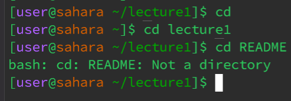
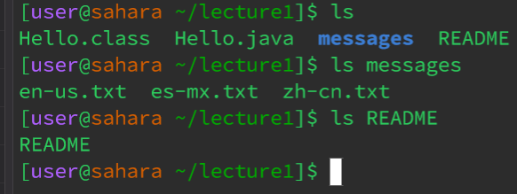
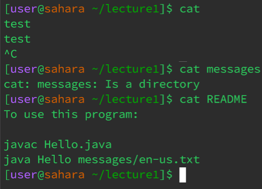

CD
1. The working directory when the command was run was /lecture1. Inputting the 'cd' command with no arguments takes you to the parent directory by default as there was no given instruction to move to a specified directory. This output is not an eror.
2. The working directory when the command was run was /home. Inputting the 'cd' command with a directory takes you to the directory as specified by the command. This output is not an eror.
3. The working directory when the command was run was /lecture1. Inputting the 'cd' command with a file takes you to the fails as the command is attempting to change directories into a file, instead stating that the specified file is "not a directory." This output is not an error.

LS
1. The working directory when the command was run was /lecture1. Inputting the 'ls' command with no arguments lists all possible arguments that can be used for commands in the current directory, as there was no directory specified in the command. This output is not an eror.
2. The working directory when the command was run was /lecture1. Inputting the 'ls' command with a directory lists all possible arguments that can be used for commands in the specified directory. This output is not an eror.
3. The working directory when the command was run was /lecture1. Inputting the 'ls' command with a file lists the file's name only, as there is no directory of files to list. This output is not an eror.

CAT
1. The working directory when the command was run was /lecture1. Inputting the 'cat' command with no arguments attempts to print an unspecified file or directory, causing it to wait for and copy inputs until the program is forcibly exited. This output is an error because the command causes the terminal to attempt to read data that does not exist, causing unintended side effects.
2. The working directory when the command was run was /lecture1. Inputting the 'cat' command with a directory as an argument prints that the specified directory "is a directory." This output is not an error.
3. The working directory when the command was run was /lecture1. Inputting the 'cat' command with a file as an argument prints the contents in the specified file. This output is not an error.
